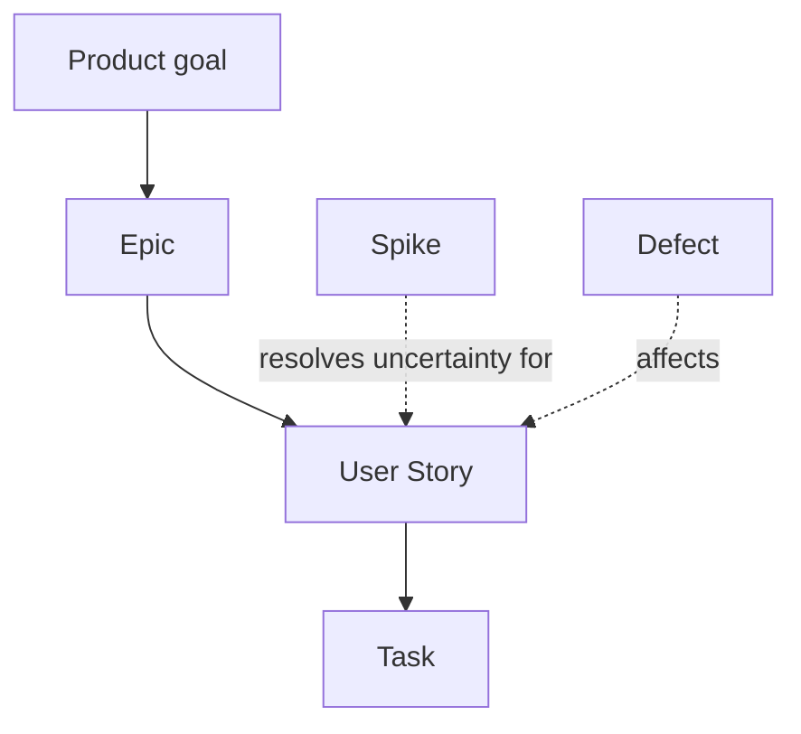

# Backlog

## Supports

| Support | Authority for | Role |
| --- | --- | --- |
| `<support>` | `<artifacts or fields>` | `<purpose>` |

## Structure

## Representation

| Artifact | Support | Native representation |
| --- | --- | --- |
| `<artifact>` | `<support>` | `<type, label, or field>` |

## Workflow

| Support | Native status | Meaning |
| --- | --- | --- |
| `<support>` | `<support value>` | `<project meaning>` |

## Planning

- Priority: `<convention>`
- Estimation: `<convention>`
- Iteration: `<convention>`
- Milestone: `<convention>`

## Relations

- Parent: `<convention>`
- Dependency: `<convention>`
- Cross-support: `<stable link or configured projection>`

<!--
Capture: durable backlog authority, representation, workflow, planning, and relation conventions.
Skip: work items, live values, technical ids, inferred mappings, and unused sections or rows.
Use Mermaid only when it makes a non-trivial structure clearer.
Remove this comment when filled.
-->
