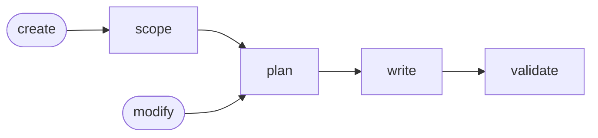

# Skill Generate

## Actions

Run the flow above. Read only the next action file.

| Action   | Does                       |
| -------- | -------------------------- |
| scope    | frame the skill and target |
| plan     | break it into actions      |
| write    | write the router and files |
| validate | review the files and fix   |

## Transversal rules

- Default to `create`; follow `modify` when asked.
- If a cited reference cannot be read, stop and report the missing file.
- Confirm every target and name with the user.
- Never write silently.
