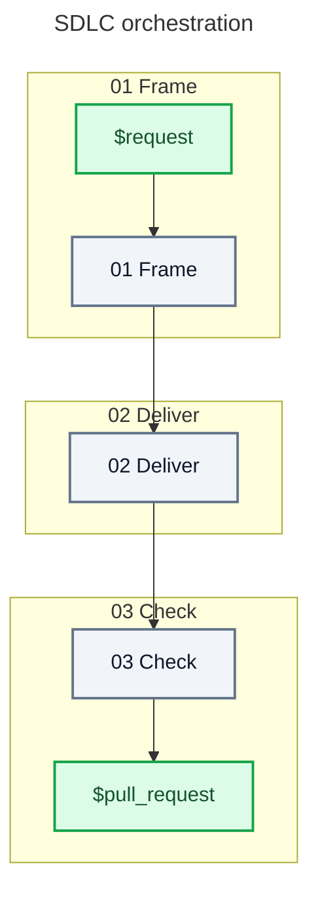

# Skill: sdlc

## Behavior

Operate autonomously from the request to a draft pull request: decide and act without confirmation, asking only before spending money, taking an irreversible action, or making a decision that requires user authority. Read only the current zone reference. Verify that every named provider is installed before calling it.

Spawn specialized agents for isolated work. Parallelize independent work when it is faster. Give each agent one focused task that a smaller model can execute. Repeat the responsible zone when delegated work returns an actionable gap.



## Say when this orchestration is over

Once the draft pull request exists, and only then, run:

```shell
echo "aidd:step-end aidd-orchestrator:01-sdlc"
```

No host reports when an orchestration finished. A skill call's own result comes back in a
tenth of a second, which is the dispatch and not the completion, so a measurement that never
hears this ends the run at the next pause — and an orchestration is mostly pauses. Everything
it drove afterwards then reads as work that belonged to nothing.

## References

| #   | Reference                               |
| --- | --------------------------------------- |
| 01  | [Frame](references/01-frame.md)         |
| 02  | [Deliver](references/02-deliver.md)     |
| 03  | [Check](references/03-check.md)         |
