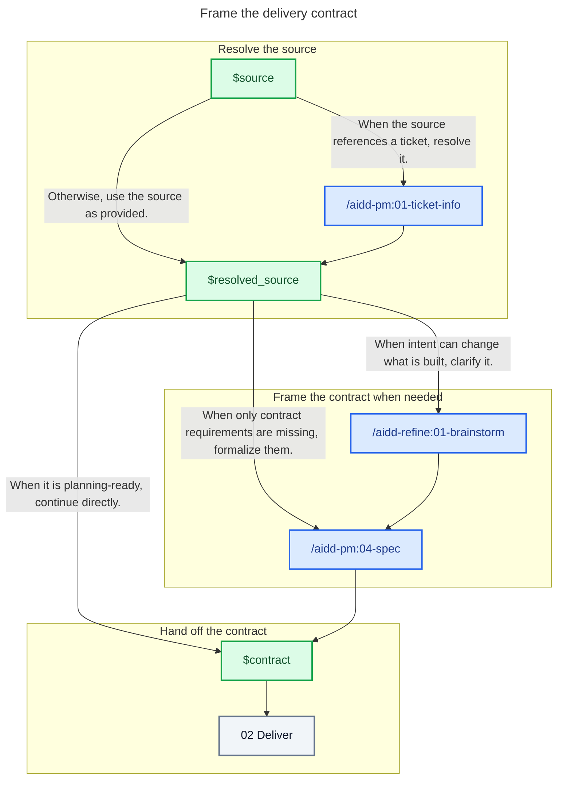

# 01 - Frame

## Behavior

Start from `$source` only. Resolve a ticket when the source references one. Use the source directly when it is planning-ready. Otherwise clarify only the intent that can change what is built, then formalize the missing contract requirements. Hand the resulting contract to Deliver.

Resolving the ticket here is the one moment its backlog item is knowable — never guessed later from a folder name or a commit message. Carry it in `$resolved_source` so whichever of Spec or Plan first creates the delivery folder can declare it there, in `backlog-link.json`; a source with no ticket carries none, and the folder simply declares nothing.

