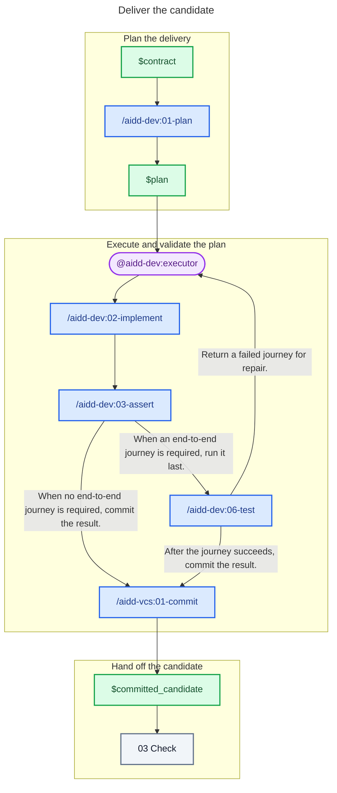

# 02 - Deliver

## Behavior

Turn the contract into a proportional plan, then give one executor the plan. The executor implements it and calls the validation skills, which own their checks and repair loops. Include architecture conformance whenever the project documents architecture. Run a required end-to-end journey after every other validation.

Commit and push the validated work through the commit skill. Send only the clean committed candidate to Check.

