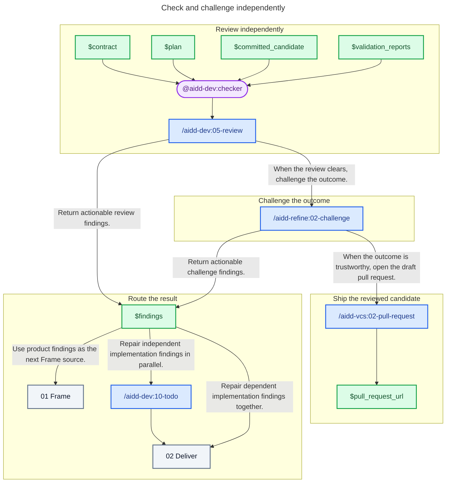

# 03 - Check

## Behavior

Use one fresh checker, independent from implementation, to review the candidate against the contract, plan, and validation evidence. After the review clears, the same checker challenges whether the real outcome is trustworthy and serves the user.

Use product or contract findings as the next Frame source. Dispatch independent implementation findings through Todo and keep dependent repairs together in Deliver. Re-enter Check after every new candidate. Open the draft pull request when the checker returns no actionable finding.

