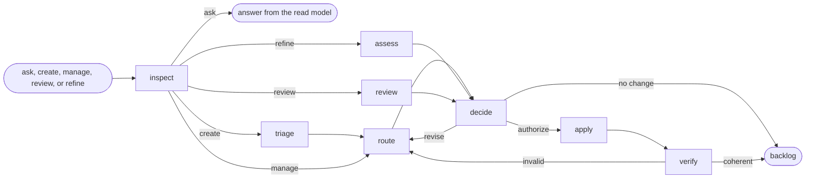

# Backlog



## Actions

Run the flow above. Read only the next action file.

| Action  | Does                                        |
| ------- | ------------------------------------------- |
| inspect | resolve the scope, event, and authority   |
| triage  | classify intake and detect existing work    |
| review  | find actionable backlog health improvements |
| route   | delegate proposed artifact changes          |
| assess  | challenge refinement from three viewpoints  |
| decide  | reconcile proposals and confirm authority   |
| apply   | delegate authorized writes                  |
| verify  | prove the resulting graph is coherent       |

## Transversal rules

- Keep product, lifecycle, and backlog decisions with the user.
- Delegate artifact work to its owning capability, resolved by purpose and verified as installed before delegating.
- Store each relation once, in its owning artifact.
- Ask natural questions; never expose internal routes, checks, or unchanged state.
- Change only authorized artifacts and fields.

## Say when this orchestration is over

Once the flow has reached `done` — an answer given, no change needed, or `verify` reporting a coherent graph, and only then, run:

```shell
echo "aidd:step-end aidd-orchestrator:02-backlog"
```

No host reports when an orchestration finished. A skill call's own result comes back in a
tenth of a second, which is the dispatch and not the completion, so a measurement that never
hears this ends the run at the next pause — and an orchestration is mostly pauses. Everything
it drove afterwards then reads as work that belonged to nothing.
