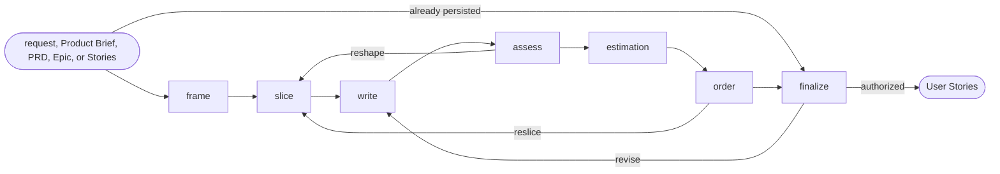

# User Stories

## Actions

Run the flow above. Read only the next action file.

| Action     | Does                                      |
| ---------- | ----------------------------------------- |
| frame      | resolve the source and Story scope        |
| slice      | find vertical deliverable slices          |
| write      | write Stories and acceptance              |
| assess     | determine readiness and blockers          |
| estimation | estimate only when applicable             |
| order      | order only when useful                    |
| finalize   | approve, persist, or transition           |

## Transversal rules

- Keep product and lifecycle decisions with the user.
- Separate evidence, decisions, and assumptions.
- Preserve source links and existing edits.
- Ask natural questions; never expose actions, references, or unchanged state.
- Require explicit approval or caller-provided bounded authority before any write.
- Draft only after actor, need, and outcome are explicit in the source or confirmed.
