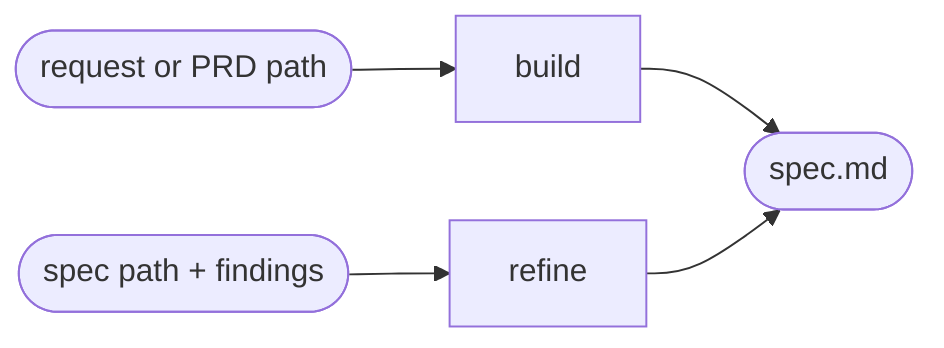

# Spec

## Actions

Run the flow above. Read only the next action file.

| Action | Does                                             |
| ------ | -------------------------------------------------- |
| build  | draft a fresh spec from a request or PRD          |
| refine | rewrite an existing spec to address findings      |

## Transversal rules

- Never invent; mark every gap instead of guessing.
- Never explore the codebase.
- Hold intent, never implementation: solution-agnostic, no how, few acceptance criteria.
- Keep it readable: clear headers, bulleted criteria, explicit non-goals.
- Immutable once validated: never rewrite a locked spec.
