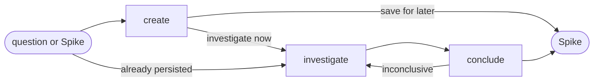

# Spike

## Actions

Run the flow above. Read only the next action file.

| Action      | Does                                  |
| ----------- | ------------------------------------- |
| create      | qualify and persist                    |
| investigate | collect evidence                       |
| conclude    | write outcome and sync parents         |

## Transversal rules

- Keep product and lifecycle decisions with the user.
- Separate evidence, decisions, and assumptions.
- Preserve source links and existing edits.
- Ask natural questions; never expose actions, references, or unchanged state.
- Require explicit approval or caller-provided bounded authority before any write.
- Bound the question; never answer beyond its stop condition.
