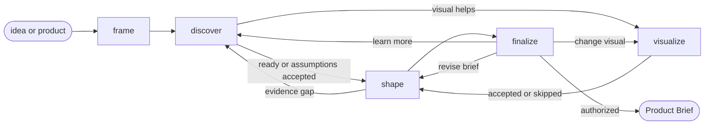

# Product Brief

## Actions

Run the flow above. Read only the next action file.

| Action    | Does                                 |
| --------- | ------------------------------------ |
| frame     | establish scope and evidence path    |
| discover  | research, question, and challenge    |
| visualize | clarify with an optional product view |
| shape     | compose one Product Brief            |
| finalize  | refine, approve, and persist          |

## Transversal rules

- Keep product and lifecycle decisions with the user.
- Separate evidence, decisions, and assumptions.
- Preserve source links and existing edits.
- Ask natural questions; never expose actions, references, or unchanged state.
- Require explicit approval or caller-provided bounded authority before any write.
- Frame the opportunity; never write requirements.
