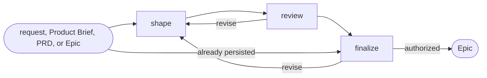

# Epic

## Actions

Run the flow above. Read only the next action file.

| Action   | Does                                  |
| -------- | ------------------------------------- |
| shape    | frame one outcome-based Epic          |
| review   | challenge its coherence and readiness |
| finalize | approve, persist, or transition             |

## Transversal rules

- Keep product and lifecycle decisions with the user.
- Separate evidence, decisions, and assumptions.
- Preserve source links and existing edits.
- Ask natural questions; never expose actions, references, or unchanged state.
- Require explicit approval or caller-provided bounded authority before any write.
- Stay at outcome level; do not propose child slices or implementation.
