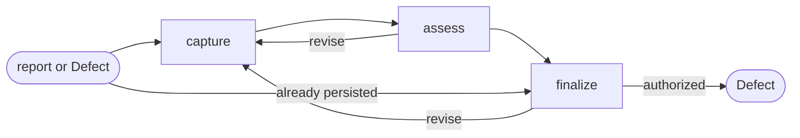

# Defect

## Actions

Run the flow above. Read only the next action file.

| Action   | Does                                      |
| -------- | ----------------------------------------- |
| capture  | frame one observed product mismatch       |
| assess   | establish evidence, impact, and readiness |
| finalize | persist or transition the Defect           |

## Transversal rules

- Keep product and lifecycle decisions with the user.
- Separate evidence, decisions, and assumptions.
- Preserve source links and existing edits.
- Ask natural questions; never expose actions, references, or unchanged state.
- Require explicit approval or caller-provided bounded authority before any write.
- Record the mismatch; never diagnose or implement its fix.
