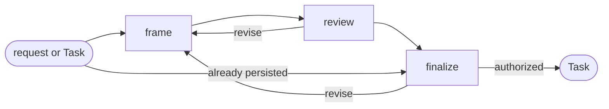

# Task

## Actions

Run the flow above. Read only the next action file.

| Action | Does |
| --- | --- |
| frame | define one bounded delivery Task |
| review | challenge its type and readiness |
| finalize | persist or transition the Task |

## Transversal rules

- Keep product and lifecycle decisions with the user.
- Separate evidence, decisions, and assumptions.
- Preserve source links and existing edits.
- Ask natural questions; never expose actions, references, or unchanged state.
- Require explicit approval or caller-provided bounded authority before any write.
- Record delivery work; never plan or implement it.
