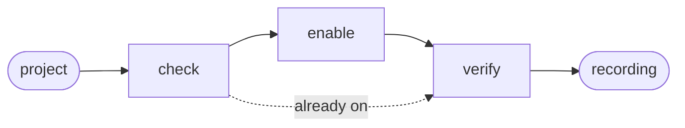
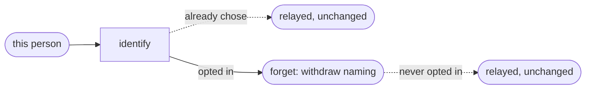
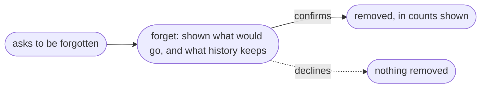

# Init

A second, independent choice belongs to the person rather than the project: whether their
own records carry an identifier at all.

A third, independent ask reaches the same action, and needs neither of the two above:
removing what this tool measured, wholly, on this machine.

## Actions

Run the flow above. Read only the next action file.

| Action   | Does                                                    |
| -------- | -------------------------------------------------------- |
| check    | confirm the CLI and read the current switch                |
| enable   | ask, then turn measurement on                              |
| verify   | prove a session is actually being recorded                 |
| identify | ask this person, then attach their own identifier, and offer to link another identifier as the same one |
| forget   | withdraw naming, or remove everything this tool measured — two different asks, one action |

## Transversal rules

- Measuring someone's project is theirs to allow. Ask before turning it on, always.
- Naming a person is theirs alone to allow, separately from the project switch above — never assumed from the project being measured, never asked on someone else's behalf.
- Run only `aidd telemetry on --yes`, `aidd telemetry off`, `aidd telemetry identity`'s own verbs, and `aidd telemetry forget`'s own verbs (preview first, `--yes` only after this person has seen it and confirmed). Never a script, and never a command belonging to another skill.
- `aidd telemetry identity` never reads `.aidd/config.json` or `AIDD_USER_CONFIG_DIR` — both are settings a repository or a CI job can set, and this choice is not theirs to make. It reads and writes only this machine's own user profile.
- Removing what was measured is irreversible, and reaches further than one project: this machine's stored records span every project ever measured on it, not only the one being discussed. Never presented as reversible, and never presented as scoped to one project when it is not.
- What history keeps is relayed exactly as `aidd telemetry forget` states it — a journal already committed as certainly held, one merely staged but never committed as not yet held, one not tracked at all as possibly held — and is never presented as removable. No command in this skill rewrites git history.
- The `aidd` command cannot be found: say so and change nothing.
