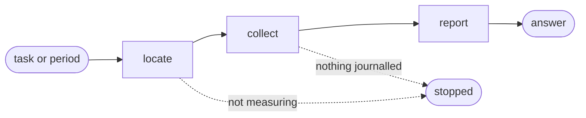

# Cost

## Actions

Run the flow above. Read only the next action file.

| Action  | Does                                              |
| ------- | -------------------------------------------------- |
| locate  | find the script and check the switch               |
| collect | read what each tool's own files hold               |
| report  | choose the axis the question needs, then answer with the artefact it deserves |

## The question, not the flag

Someone asking what last month cost does not know which axis answers them. Read the
question, offer these axes in its own language, and derive the flags - never hand back a
menu and ask them to pick.

| The question sounds like | Axis | Artefact |
| --- | --- | --- |
| what did this cost, how much did it use | total | one total, in a line |
| what changed, which day spiked | day | a series, one row per day |
| where did it go, which step, model, tool or project took it | step, model, tool or project | a breakdown table |
| which framework task | task | one row per task declared in the period, plus the remainder with no task declared |
| per backlog item, per ticket, what did issue X cost | backlog | one row per backlog item a task declared, plus tasks that named none, plus the remainder with no task at all |
| per orchestrated run, per flow, what did that pipeline cost | flow | one row per orchestrated run the journal's own sequence names, plus the remainder that ran outside any flow |
| which subagent, what did delegation cost | agent | one row per agent that ran, plus the main thread's own row |
| which prompt, which turn, what did one request cost | prompt | one row per prompt that caused work, dated, plus the row for records naming none |
| for a report, to paste, to send, to keep | any of the above | the same artefact, written to a file |
| per person, who spent, which teammate | person | one row per resolved person plus every unresolved identity, each with the raw identities behind it |

## Transversal rules

- Answer only through `aidd telemetry read` and `aidd telemetry report`. Never a script beside this skill: the report is computed in one place, and that place is the CLI.
- Report what the script printed. Recomputing a figure a second way is how two figures start disagreeing.
- An absent number is not a zero. Say the figure is unknown and give what is known instead.
- Turning measurement on belongs elsewhere. Stop and say so rather than doing it here.
- The script cannot be found or fails: say so and show no figure.
