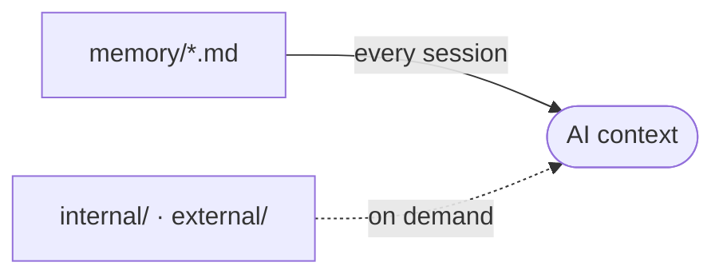

# memory/ - Project Memory

Structured context the AI assistant reads at the start of a session, so it does not rediscover the project each time.

## How it loads

The root files load every session through the project memory block in each AI context file. `internal/` and `external/` load only when relevant.

## Files

Refreshed automatically by the memory hook. Do not edit by hand.

<!-- files:start -->
- `aidd_docs/memory/project-brief.md`
- `aidd_docs/memory/architecture.md`
- `aidd_docs/memory/codebase-map.md`
- `aidd_docs/memory/coding-assertions.md`
- `aidd_docs/memory/testing.md`
- `aidd_docs/memory/vcs.md`
- `aidd_docs/memory/ecosystem.md`
- `aidd_docs/memory/cli.md`
<!-- files:end -->

## Subdirectories

- `internal/`: AIDD workflow traces (the capability profile, audit notes, learn captures).
- `external/`: external references (ARCHITECTURE.md, implementation_plan.md).
