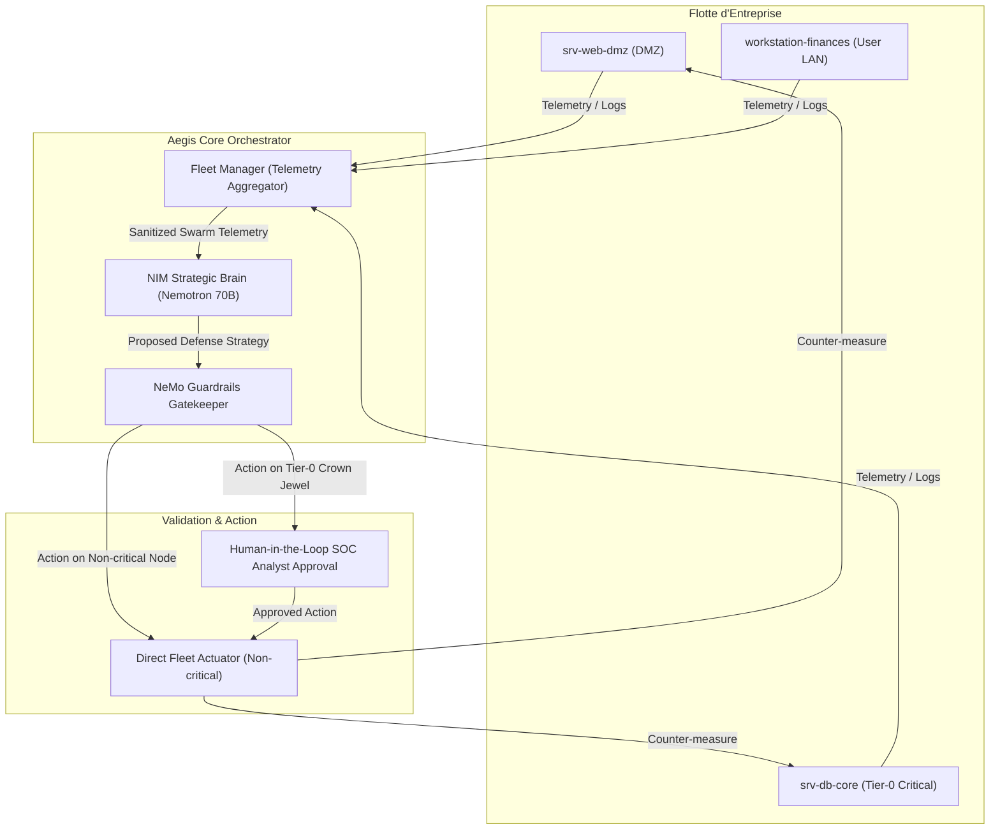

# Architecture

The macro technical shape: the stack, how the pieces fit, and the decisions behind them. Point to the code, do not restate it.

## Stack

- **Runtime :** Python 3.11+
- **Inférence LLM :** NVIDIA NIM (`nvidia/llama-3.1-nemotron-70b-instruct`) via API compatible OpenAI (`https://integrate.api.nvidia.com/v1` ou endpoint HPE privé)
- **Gouvernance & Sécurité :** NVIDIA NeMo Guardrails (`nemoguardrails`) avec Colang (`.co`) et configuration YAML
- **Modélisation & Validation :** Pydantic v2 (modèles stricts typés pour la télémétrie, nœuds, actions et stratégies)
- **Interface Terminal :** Rich (tableaux, statuts, alertes couleur)

## How it fits together

The macro flow between the main parts. One box per area, high level only.

## Key decisions

- **Découplage Stratégie / Autorisation :** Le LLM (Nemotron 70B) propose la stratégie de défense, mais n'a aucun pouvoir direct d'exécution sur le système. C'est NeMo Guardrails qui a force exécutoire.
- **Format universel OpenAI NIM :** Facilite la portabilité immédiate entre le bac à sable cloud NVIDIA (`build.nvidia.com`) et les appliances HPE sur site.
- **Immunité aux injections indirectes :** Les logs d'attaquants sont traités comme des données non fiables via un Input Rail NeMo avant soumission au LLM.
- **Orthogonalité AIDD vs NeMo Guardrails :** AIDD régit uniquement le workflow d'ingénierie et l'assistance de code (fichiers markdown dans `.agents/` et `aidd_docs/`). NeMo Guardrails est la brique applicative Python (`nemoguardrails`, Colang `.co`) exécutée au runtime. Zéro interférence, zéro couplage.

## Gotchas

- NeMo Guardrails nécessite des définitions Colang (`swarm_rails.co`) précises sans ambiguïté syntaxique.
- L'appel aux endpoints NIM requiert un en-tête `Authorization: Bearer nvapi-...`.
