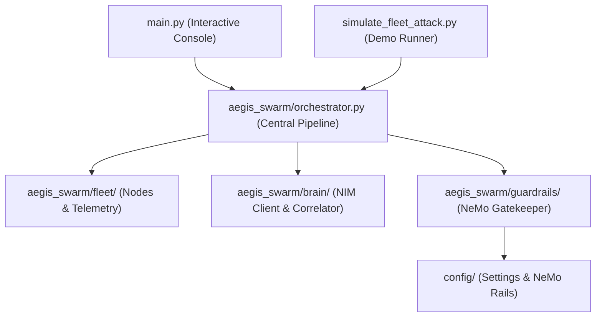

# Codebase Map

The macro layout: the top-level areas and what each holds. A map to navigate, not the full tree.

## Areas

- `config/`: Paramètres globaux (`settings.py`), configuration NeMo Guardrails (`config.yml`), politiques d'action Colang (`swarm_rails.co`).
- `aegis_agent/`: Micro-agent daemon HTTP autonome multi-OS (`daemon.py`) déployable sur serveurs physiques et postes de travail distants.
- `aegis_swarm/`: Cœur du framework agentique de cyberdéfense.
  - `models.py`: Schémas typés Pydantic (Node, Alert, Telemetry, Action, SwarmStrategy).
  - `fleet/`: Gestionnaire de flotte (`fleet_manager.py`), instances nœuds (`node.py`) et actionneurs (`actuators/`: `SimulatedActuator`, `LocalOSActuator`, `AgentActuator`).
  - `brain/`: Client unifié NVIDIA NIM (`nim_client.py`) et moteur de corrélation multi-alertes (`strategist.py`).
  - `guardrails/`: Passerelle de validation NeMo Guardrails (`gatekeeper.py`).
  - `orchestrator.py`: Pipeline unifié Flotte -> Cerveau NIM -> Garde-fous -> Actuateurs.
- `aidd_docs/`: Documentation, mémoire pérenne et historique des tâches AIDD.

## Entry points

- `main.py`: Console interactive SOC / CLI pour piloter la flotte et visualiser les alertes.
- `simulate_fleet_attack.py`: Scénario scénarisé d'attaque multi-nœuds (pitch hackathon HPE & NVIDIA).
