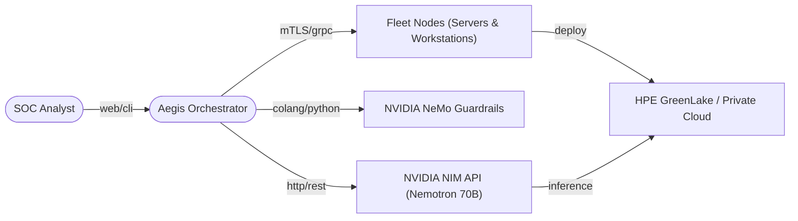

# Ecosystem

```mermaid
flowchart LR
  Human([SOC Analyst])
  Agent([Aegis Orchestrator])
  NIM["NVIDIA NIM API (Nemotron 70B)"]
  NeMo["NVIDIA NeMo Guardrails"]
  Fleet["Fleet Nodes (Servers & Workstations)"]
  HPE["HPE GreenLake / Private Cloud"]

  Human -- web/cli --> Agent
  Agent -- http/rest --> NIM
  Agent -- colang/python --> NeMo
  Agent -- mTLS/grpc --> Fleet
  Fleet -- deploy --> HPE
  NIM -- inference --> HPE
```
