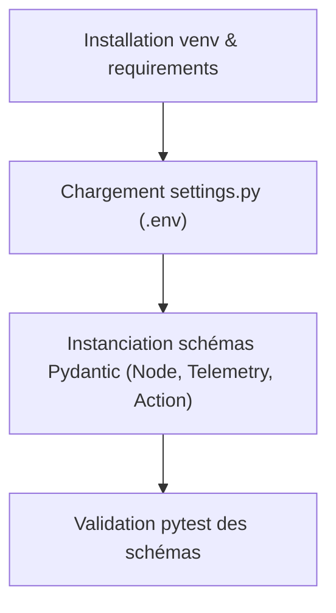
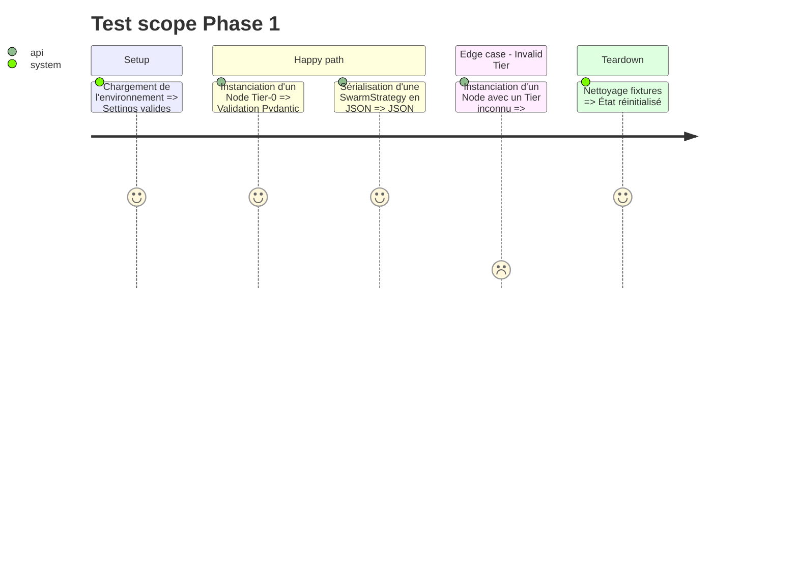

# Instruction: Phase 1 - Socle, Configuration & Modèles Typés

## Architecture projection

> Tree of the final files. ✅ create · ✏️ modify · ❌ delete

```txt
.
├── requirements.txt           ✅ Dépendances Python (nemoguardrails, pydantic, rich, openai, pytest)
├── .env.example               ✅ Template de configuration des clés API
├── config/
│   ├── __init__.py            ✅
│   └── settings.py            ✅ Configuration Pydantic (endpoints, timeouts, modes mock)
├── aegis_swarm/
│   ├── __init__.py            ✅
│   └── models.py              ✅ Schémas Pydantic (Node, Alert, Telemetry, Action, SwarmStrategy)
└── tests/
    ├── __init__.py            ✅
    └── test_models.py         ✅ Tests unitaires des modèles et sérialisation
```

## User Journey



## Test Scope



## Tasks to do

### `1)` Initialisation des dépendances et de l'environnement
> Créer `requirements.txt` et `.env.example`.

1. Ajouter `nemoguardrails`, `pydantic>=2.0`, `rich`, `openai`, `python-dotenv`, `pytest`.
2. Créer `.env.example` avec `NVIDIA_API_KEY`, `NIM_BASE_URL`, `SIMULATION_TIMEOUT_SEC`.

### `2)` Configuration centralisée (`config/settings.py`)
> Définir les paramètres d'exécution avec Pydantic Settings.

1. Définir les timeouts (30s démo, 300s prod), URLs NIM, flags `MOCK_MODE`.

### `3)` Modèles de données typés (`aegis_swarm/models.py`)
> Définir les enums et structures de données.

1. Énumérations : `NodeRole` (DMZ, DB, WORKSTATION), `NodeTier` (TIER_0_CROWN_JEWEL, TIER_1, TIER_2), `ActionType` (ISOLATE_NODE, BLOCK_IP, QUARANTINE_PORT, KILL_PROCESS).
2. Schémas Pydantic : `Node`, `TelemetryEvent`, `SecurityAlert`, `ProposedAction`, `SwarmStrategy`.

### `4)` Tests de validation (`tests/test_models.py`)
> Écrire et exécuter la suite de tests unitaires pour valider les modèles.

## Test acceptance criteria

| Task | Acceptance criteria |
| ---- | ------------------- |
| 1 | `pip install -r requirements.txt` s'exécute sans conflit |
| 2 | `config/settings.py` charge les variables avec valeurs par défaut saines |
| 3 | Les modèles `Node` et `SwarmStrategy` valident les contraintes et refusent les types invalides |
| 4 | `pytest tests/test_models.py` passe à 100% |
