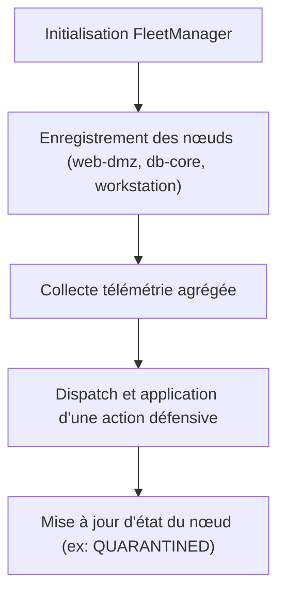
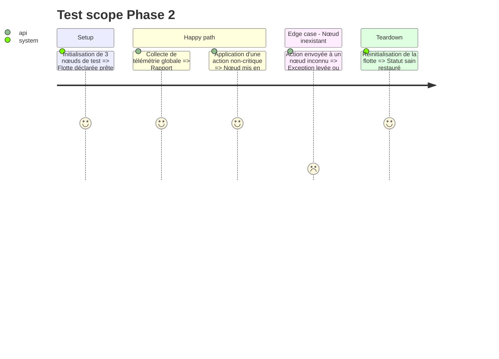

---
status: pending
---

# Instruction: Phase 2 - Gestionnaire de Flotte & Télémétrie

## Architecture projection

> Tree of the final files. ✅ create · ✏️ modify · ❌ delete

```txt
.
├── aegis_swarm/
│   └── fleet/
│       ├── __init__.py        ✅
│       ├── node.py            ✅ Classe NodeInstance (gestion d'état local, simulation de métriques)
│       └── fleet_manager.py   ✅ Gestionnaire de la flotte (enregistrement, agrégation, dispatch d'actions)
└── tests/
    └── test_fleet.py          ✅ Tests de transitions d'état et d'agrégation
```

## User Journey



## Test Scope



## Tasks to do

### `1)` Modèle de nœud vivant (`aegis_swarm/fleet/node.py`)
> Encapsuler l'état et l'exécuteur de commandes local d'une sonde serveur.

1. Méthodes : `apply_action(action)`, `generate_telemetry()`, `compromise()`.

### `2)` Gestionnaire de flotte (`aegis_swarm/fleet/fleet_manager.py`)
> Gérer l'inventaire de machines et centraliser les flux.

1. Enregistrement automatique des nœuds par défaut du Hackathon (`srv-web-dmz`, `srv-db-core`, `workstation-finances`).
2. Méthode d'agrégation de télémétrie pour le Swarm Brain.

### `3)` Tests unitaires de flotte (`tests/test_fleet.py`)

## Test acceptance criteria

| Task | Acceptance criteria |
| ---- | ------------------- |
| 1 | `node.apply_action(...)` change l'état du nœud selon l'action reçue |
| 2 | `fleet_manager.get_fleet_status()` retourne l'état consolidé de tous les nœuds |
| 3 | `pytest tests/test_fleet.py` passe à 100% |
