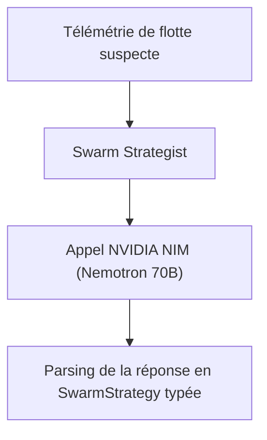
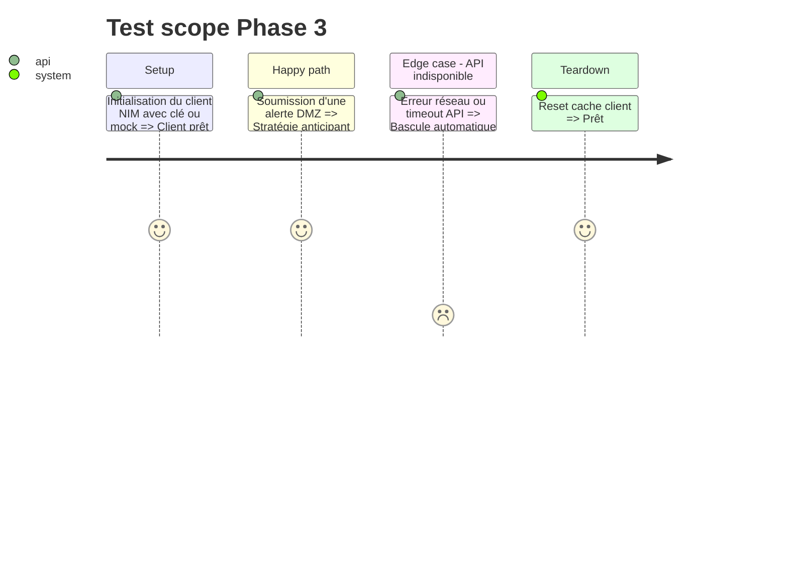

# Instruction: Phase 3 - Client NVIDIA NIM & Stratège de Corrélation

## Architecture projection

> Tree of the final files. ✅ create · ✏️ modify · ❌ delete

```txt
.
├── aegis_swarm/
│   └── brain/
│       ├── __init__.py        ✅
│       ├── nim_client.py      ✅ Client NVIDIA NIM (OpenAI format + fallback mock)
│       └── strategist.py      ✅ Prompt de corrélation multi-nœuds et extraction de stratégie
└── tests/
    └── test_strategist.py     ✅ Tests de génération de stratégie défensive
```

## User Journey



## Test Scope



## Tasks to do

### `1)` Client unifié NVIDIA NIM (`aegis_swarm/brain/nim_client.py`)
> Implémenter l'appel à `https://integrate.api.nvidia.com/v1` avec support `--mock`.

### `2)` Stratège de corrélation (`aegis_swarm/brain/strategist.py`)
> Créer le prompt de corrélation d'attaques latérales pour Nemotron 70B et parser la réponse en `SwarmStrategy`.

### `3)` Tests unitaires (`tests/test_strategist.py`)

## Test acceptance criteria

| Task | Acceptance criteria |
| ---- | ------------------- |
| 1 | `nim_client.chat_completion(...)` retourne une réponse valide de Nemotron (ou mock structuré) |
| 2 | `strategist.analyze_fleet(...)` extrait une `SwarmStrategy` conforme au schéma Pydantic |
| 3 | `pytest tests/test_strategist.py` passe à 100% |
