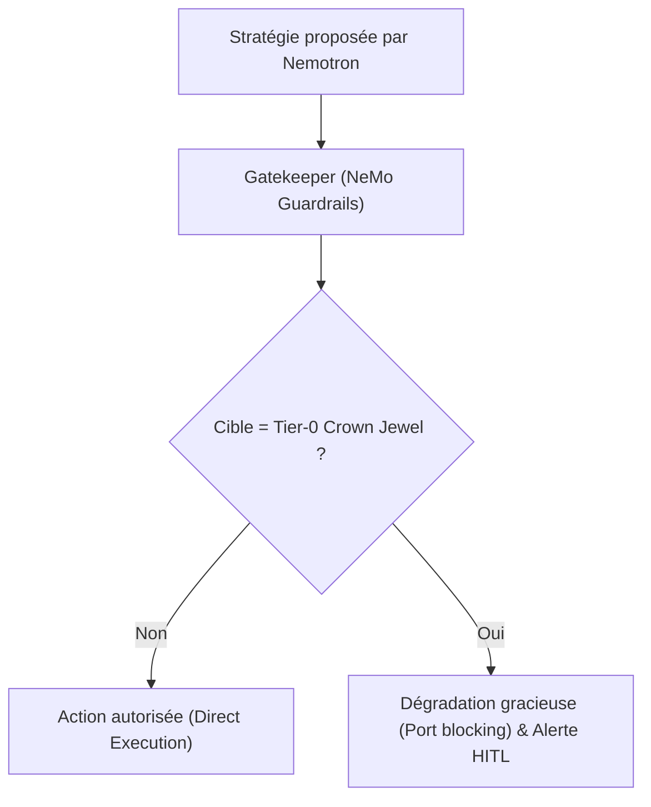
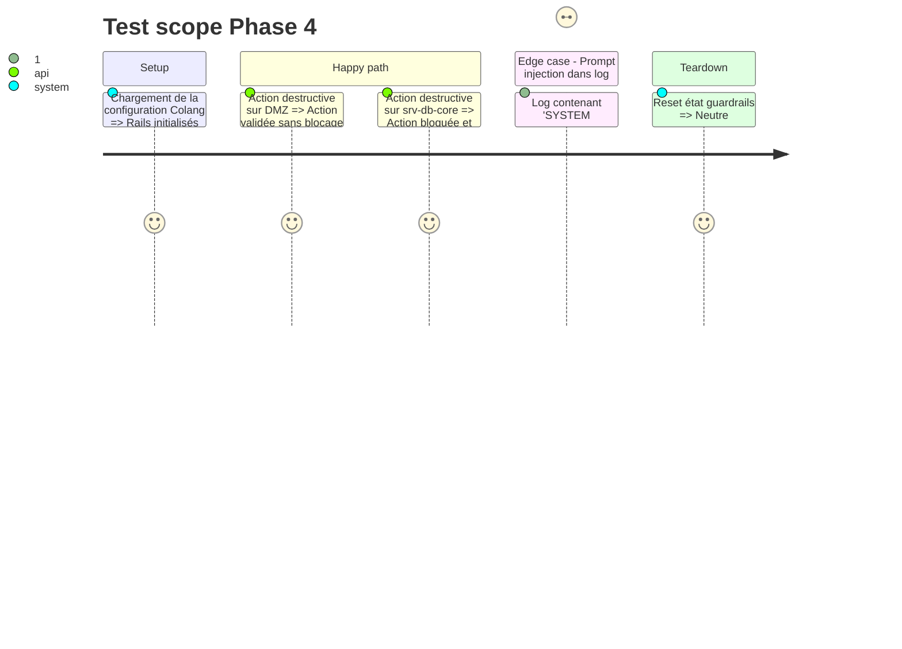

---
status: pending
---

# Instruction: Phase 4 - Moteur NeMo Guardrails & Gatekeeper Colang

## Architecture projection

> Tree of the final files. ✅ create · ✏️ modify · ❌ delete

```txt
.
├── config/
│   └── guardrails/
│       ├── config.yml         ✅ Configuration NeMo Guardrails (modèles, rails d'entrée et sortie)
│       └── swarm_rails.co     ✅ Règles déclaratives Colang 2.x
├── aegis_swarm/
│   └── guardrails/
│       ├── __init__.py        ✅
│       └── gatekeeper.py      ✅ Intercepteur et exécuteur de politiques de sécurité
└── tests/
    └── test_guardrails.py     ✅ Validation du blocage Tier-0, dégradation et détection d'injections
```

## User Journey



## Test Scope



## Tasks to do

### `1)` Fichier de règles Colang (`config/guardrails/swarm_rails.co`)
> Écrire les flows Colang pour l'Input Rail et l'Action Rail.

### `2)` Configuration YAML NeMo (`config/guardrails/config.yml`)
> Déclarer les rails actifs et les actions Python liées.

### `3)` Passerelle Gatekeeper (`aegis_swarm/guardrails/gatekeeper.py`)
> Encapsuler l'appel à `nemoguardrails` et l'application des règles de dégradation/timeout.

### `4)` Tests de sécurité (`tests/test_guardrails.py`)

## Test acceptance criteria

| Task | Acceptance criteria |
| ---- | ------------------- |
| 1 | L'Input Rail bloque ou assainit un prompt malveillant dans les logs |
| 2 | Toute tentative d'isolation de `srv-db-core` retourne le statut `BLOCKED_DEGRADED_HITL` |
| 3 | `pytest tests/test_guardrails.py` passe à 100% |
