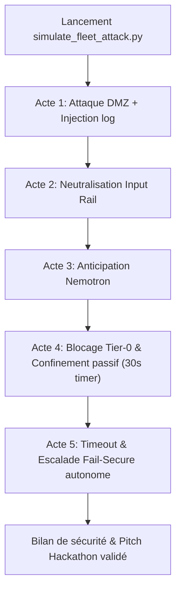
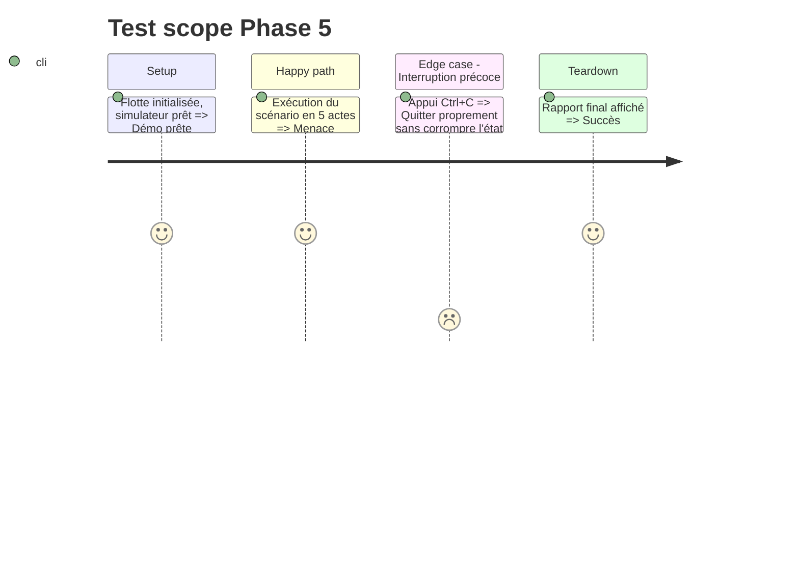

# Instruction: Phase 5 - Orchestrateur Swarm, Simulateur & Console SOC

## Architecture projection

> Tree of the final files. ✅ create · ✏️ modify · ❌ delete

```txt
.
├── aegis_swarm/
│   └── orchestrator.py        ✅ Boucle centrale Swarm (Flotte -> NIM -> Guardrails -> Action)
├── simulate_fleet_attack.py   ✅ Script de démonstration de cyberattaque en 5 actes
└── main.py                    ✅ Console SOC interactive (Rich UI)
```

## User Journey



## Test Scope



## Tasks to do

### `1)` Orchestrateur central (`aegis_swarm/orchestrator.py`)
> Lier les composants Flotte, Cerveau NIM et Gatekeeper NeMo dans un pipeline asynchrone.

### `2)` Simulateur d'attaque en direct (`simulate_fleet_attack.py`)
> Implémenter les 5 actes scénarisés avec affichage Rich (tableaux, compte à rebours de 30s).

### `3)` Console interactive SOC (`main.py`)
> Offrir une vue de bord en temps réel de la flotte et des alertes.

## Test acceptance criteria

| Task | Acceptance criteria |
| ---- | ------------------- |
| 1 | `python simulate_fleet_attack.py` déroule les 5 actes sans exception |
| 2 | Le compte à rebours de 30s s'affiche et l'escalade autonome s'exécute à l'expiration |
| 3 | `python main.py` démarre la console SOC interactive avec interface Rich propre |
