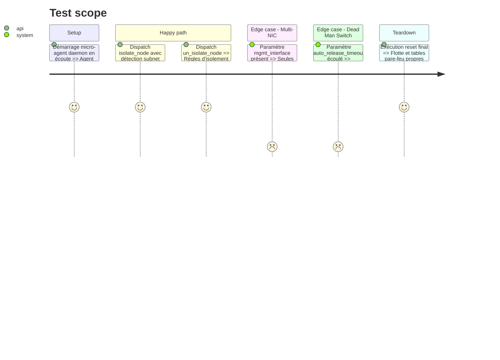

# Instruction: Phase 1 - Isolation Sélective, Whitelist Sous-Réseau SOC /24, Multi-NIC & Déblocage

## Architecture projection

> Tree of the final files. ✅ create · ✏️ modify · ❌ delete

```txt
.
├── aegis_agent/
│   └── daemon.py                                 ✏️ Isolation sélective (whitelist sous-réseau SOC /24, socket caller, multi-NIC, dead man timer, un_isolate)
├── aegis_swarm/
│   ├── models.py                                 ✏️ Ajout de ActionType.UN_ISOLATE_NODE
│   └── fleet/
│       ├── node.py                               ✏️ Support de un_isolate et mise à jour du statut
│       └── actuators/
│           ├── base.py                           ✏️ Prise en compte de un_isolate
│           ├── simulated.py                      ✏️ Simulation de un_isolate
│           ├── local_os.py                       ✏️ Commandes Windows netsh / Linux iptables avec whitelist sous-réseau /24 et levée
│           └── agent_actuator.py                 ✏️ Transmission des paramètres soc_ip/soc_subnet, mgmt_iface et support un_isolate
├── tests/
│   └── test_actuators.py                         ✏️ Tests unitaires isolation sélective, sous-réseau /24, multi-NIC et déblocage
└── main.py                                       ✏️ Ajout de l'action Débloquer / Rétablir le réseau (un_isolate)
```

## User Journey

```mermaid
flowchart TD
    Incident["Menace active détectée sur nœud physique"] --> Action["Ordre: isolate_node avec détection automatique du sous-réseau SOC"]
    Action --> CheckNIC{"Carte mgmt dédiée ?"}
    CheckNIC -->|Oui (Multi-NIC)| CutProd["Désactive interface de production (ex: eno1), garde eno2 intacte"]
    CheckNIC -->|Non (Monocarte)| FirewallRule["Règle Pare-feu: Bloque tout SAUF sous-réseau SOC /24 sur port 8443"]
    FirewallRule --> Confined["Nœud isolé du LAN/Internet mais joignable par le SOC"]
    CutProd --> Confined
    Confined --> Remediation["SOC: investigations, arrêt de processus, éradication"]
    Remediation --> Release["Ordre SOC: un_isolate_node"]
    Release --> Restored["Suppression des règles de confinement, statut sain restauré"]
```

## Test Scope



## Tasks to do

### `1)` Modèle & Types

> Étendre `ActionType` avec l'action de déconfinement

1. Ajouter `UN_ISOLATE_NODE = "un_isolate"` dans `aegis_swarm/models.py`.

### `2)` Moteur d'isolation du Daemon (`aegis_agent/daemon.py`)

> Implémenter l'isolation sélective avec whitelist sous-réseau /24 et timer

1. Modifier `execute_action("isolate_node", params)` pour extraire `soc_subnet` ou `soc_ip` (avec détection automatique depuis le socket TCP appelant `self.client_address[0]`) et calculer le sous-réseau `/24` (ex: `192.168.1.0/24`).
2. Sous Windows : créer la règle de blocage global ET la règle prioritaire autorisant le sous-réseau `/24` sur le port 8443.
3. Sous Linux : insérer `iptables -I INPUT -s <soc_subnet> -p tcp --dport 8443 -j ACCEPT` avant le `DROP`.
4. Si `mgmt_interface` est renseigné : désactiver uniquement l'interface de production.
5. Implémenter `execute_action("un_isolate", params)` qui purge les règles d'isolation et rétablit les interfaces.
6. Si `auto_release_timeout` est renseigné : lancer un thread `threading.Timer` restaurant le réseau à expiration.

### `3)` Actionneurs Flotte & Console SOC

> Câbler les nouveaux paramètres dans `LocalOSActuator`, `AgentActuator` et `main.py`

1. Détecter le sous-réseau local de l'orchestrateur pour le passer en `soc_subnet`.
2. Permettre à l'analyste SOC dans `main.py` de lever l'isolement d'une machine d'un simple clic (`un_isolate`).

## Test acceptance criteria

| Task | Acceptance criteria |
| ---- | ------------------- |
| 1 | `ActionType.UN_ISOLATE_NODE` est sérialisable et reconnu par Pydantic |
| 2 | Une isolation avec IP socket `192.168.1.50` génère une règle whitelist contenant le sous-réseau `192.168.1.0/24` sur port 8443 |
| 2 | L'appel `un_isolate` supprime la règle d'isolation et repasse le nœud en statut non-isolé |
| 3 | Tous les tests unitaires (`pytest tests/ -v`) passent à 100% |
