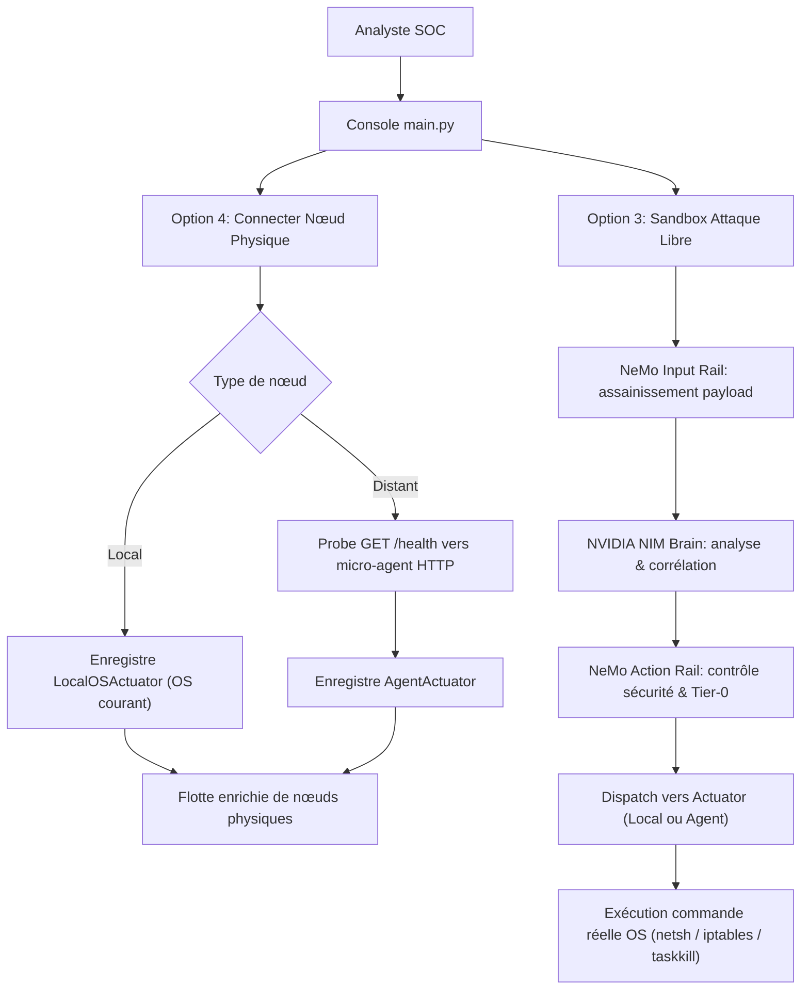

# Instruction: Phase 1 - Actionneurs Pluggables, Micro-Agent Multi-OS & Intégration SOC

## Architecture projection

> Arborescence des fichiers créés et modifiés. ✅ créé · ✏️ modifié · ❌ supprimé

```txt
.
├── aegis_agent/
│   ├── __init__.py                               ✅ Package micro-agent
│   └── daemon.py                                 ✅ Micro-Agent Daemon HTTP autonome multi-OS (Windows/Linux)
├── aegis_swarm/
│   ├── brain/
│   │   ├── nim_client.py                         ✏️ Support timeouts, max_tokens et logging erreurs
│   │   └── strategist.py                         ✏️ Extracteur JSON robuste et schema de prompt strict
│   └── fleet/
│       ├── node.py                               ✏️ Intégration de l'actuator dans NodeInstance
│       ├── fleet_manager.py                      ✏️ Résolution ID/Hostname et register_physical_node
│       └── actuators/
│           ├── __init__.py                       ✅ Package actionneurs
│           ├── base.py                           ✅ BaseActuator & modèle ExecutionResult
│           ├── simulated.py                      ✅ SimulatedActuator (in-memory)
│           ├── local_os.py                       ✅ LocalOSActuator (commandes Windows netsh / Linux iptables)
│           └── agent_actuator.py                 ✅ AgentActuator (client HTTP vers daemon distant)
├── config/
│   └── settings.py                               ✏️ Modèle NIM actif et timeouts
├── tests/
│   ├── conftest.py                               ✅ Fixture d'hermétisme mock pour tests unitaires
│   └── test_actuators.py                         ✅ Tests unitaires des actionneurs et du daemon
├── simulate_fleet_attack.py                      ✏️ Colonne Actionneur dans display_fleet_table
└── main.py                                       ✏️ Mode Sandbox interactif + connexion nœuds physiques
```

## User Journey



## Test Scope

| Test | Objective | Success Criteria |
| ---- | --------- | ---------------- |
| `test_simulated_actuator_actions` | Valider les actions in-memory | NodeStatus mis à jour, `[MOCK]` tracé |
| `test_local_os_actuator_dry_run` | Valider la génération des commandes Windows/Linux | `netsh` ou `iptables` présent dans la commande, pas de plantage OS |
| `test_agent_daemon_state_dry_run` | Valider la machine d'état du daemon | Rules appliquées, `flush_aegis_rules()` restaure le statut sain |
| `pytest tests/ -v` | Non-régression totale | 18/18 tests passants en < 2s |
